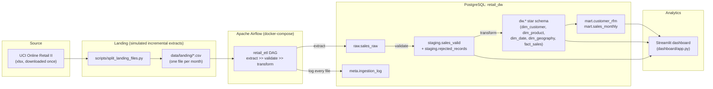

# Architecture

## Layers
- **Source**: UCI Online Retail II, downloaded once into `data/raw_download/`.
- **Landing**: `scripts/split_landing_files.py` slices the dataset into 25 monthly CSVs
  under `data/landing/`, standing in for the "simulated monthly extract" incremental source.
- **Ingestion / orchestration**: a single Airflow DAG (`retail_etl`) with three tasks —
  extract, validate, transform — each idempotent and independently re-runnable.
- **Raw layer**: `raw.sales_raw` — unmodified text columns + file provenance.
- **Staging layer**: `staging.sales_valid` (typed, validated) and
  `staging.rejected_records` (failed rows + reason).
- **Warehouse (dw) layer**: star schema — one fact table, four dimensions.
- **Mart layer**: `mart.customer_rfm` and `mart.sales_monthly`, purpose-built for the dashboard.
- **Analytics layer**: Streamlit dashboard reading directly from the mart/dw layers.

## Why these choices
- **LocalExecutor / single Postgres container** with two databases (`airflow` for Airflow's
  own metadata, `retail_dw` for the warehouse): the project runs on one machine, so
  CeleryExecutor + Redis + multiple workers would be unused complexity.
- **Streamlit over Tableau Public**: Part 2 of the assignment (not built here) needs live
  model-prediction integration, which Tableau Public can't do (no live DB connection). Building
  the dashboard once in Streamlit avoids rebuilding it later.
- **Full dw/mart rebuild each DAG run** rather than incremental dimension merges: staging
  data is small enough (under a million rows) that a full rebuild from `staging.sales_valid`
  is simpler and safer than incremental upsert logic for dimensions. Incremental behavior is
  still real — it happens at the extract/staging layer, where already-loaded files and
  already-staged rows are skipped on re-run.
